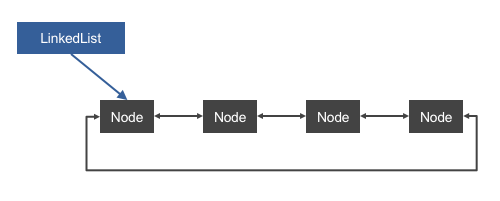

# js-linkedlist

js-linkedlist is an implementation of the doubly-linked list in JavaScript. It provides a versatile and intuitive interface for manipulating items in a list. Internally the list is represented as a circular list of nodes along with a reference to the head of the list. The circular arrangement of the list forces all nodes to have non-null pointers, significantly simplifying the implementation. The diagram below shows a conceptual view of the implementation. Note that an empty list is represented by the head pointing to null.



Each node in the list consists of its data along with references to the next and previous nodes. For example:

```javascript
{
    data: {symbol: 'AAPL', price: 108},
    next: reference-to-next-node,
    prev: reference-to-previous-node
}
```

## Quick Start

### Creating a new list

```javascript
var list = new LinkedList();
```

### Adding nodes

```javascript
list.add(1);
list.add(2);
```

You can also chain the add method:

```javascript
list.add(1).add(2);
```

### Iterating through a list
Use the `each()` method to iterate through a list. `each()` takes an iteratee function that is called for each node.

```javascript
var list = new LinkedList();
list.add({symbol: 'AAPL', price: 108}).add({symbol: 'GOOG', price: 748});

// Increase the price of each security by 10%
var iteratee = function(node) {
    node.data.price *= 1.10;
};
list.each(iteratee);
```

### Finding a node
Find a node using the `find()` method. It takes a predicate function which is called for each node. The `find` method returns the first node that returns `true` from the predicate function, or `undefined` if no node returns `true`.

```javascript
var list = new LinkedList();
list.add({symbol: 'AAPL', price: 108}).add({symbol: 'GOOG', price: 748});

// Find 'GOOG'
var predicate = function(node) {
    return node.data.symbol === 'GOOG';
};
list.find(predicate);
```

### Modifiying a list during iteration
You can modify a list during iteration, but you must stop the iteration once you have modified the list (return `false` from the iteratee function). The state of the iterator is undefined once the list is modified.

```javascript
var list = new LinkedList();
list.add(1).add(2).add(4).add(5);

var data = 3;
var iteratee = function(node, list) {
    if (node.data > data) {
        list.addBefore(node, data);
        return false;
    }
    else if (list.isTail(node)) {
        list.addAfter(node, data);
        return false;
    }
};

// Insert data at the correct position in the list
list.each(iteratee);
```

### Converting a list to an array
The `toArray()` method converts the linked list to an array:

```javascript
var list = new LinkedList();
list.add(1).add(2).add(3).add(4);

// Convert the list to an array.
// This will return [1, 2, 3, 4].
list.toArray();
```

## API

The full API is listed [here](https://github.com/archfirst/js-linkedlist/blob/master/src/linkedlist.js).
